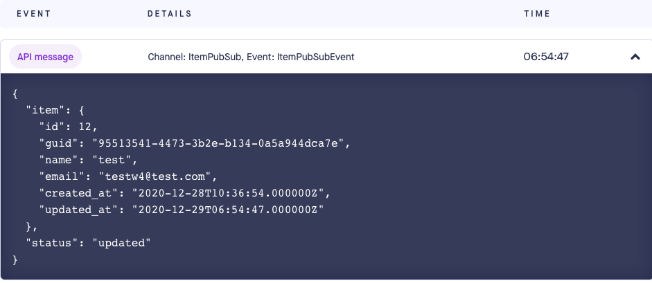

#  Lumen Item Microservice

### Code Structure
```
+-- .docker <docker containers definition files>
|   +-- nginx
|       +-- ..
|   +-- fpm
+-- .github <Github actions definition file>
|   +-- workflows
|       +-- ci.yml
+-- api <project root>
+-- docs <project root>
|   +-- api.MD 
|   +-- api.MD 
+-- .gitignore
+-- docker-compose.yml
+-- env.example
+-- README.MD 
```

## Environment Setup
This Application consisted of the following containers:

- itemservice_fpm       PHP 7.4 FPM container 
- itemservice_nginx     Nginx Container
- itemservice_db        Mysql Container
- itemservice_db_test   Mysql container for test

**Installation steps:** 

1. Create an `.env` file from `.env.example`
```bash
cp .env.example .env
# Customize every variable according to your needs
# See comments to each variable in .env.example file
```
2. Run the following command to start build and run the container under the root directory
```bash
docker-compose up -d
```

3. After docker containers is up, enter the fpm container to install Dependencies
```bash
docker exec -it itemservice_fpm bash
composer install
```

4. Copy local .env and setup database 
```bash
php -r "file_exists('.env') || copy('.env.example', '.env');"
php artisan migrate --seed
```

5. Access the application by following url http://localhost

## Item Microservice Description
This service build in Lumen framework 8.2.1.

Item entity consist guid, name and email field, the email and guid field are unique.


### API Endpoint
The application integrates 5 API endpoints:

    1 List all Items
    2 Create a new Item
    3 View a single Item information given by it id
    4 Update an Item information given by it id
    5 Delete an Item given by it id

A simple API document doc is available [here](./docs/api.MD) and Postman Collection can be download [here](./docs/item_mircoservice.postman_collection.json)

### Event and Broadcasting
When an item is added, updated  or deleted the item service will broadcast the event to other mircoservice. 

Lumen supports several broadcast drivers out of the box: Pusher Channels, Redis, and a log driver for local development and debugging.

This application using  [Pusher Channels](https://pusher.com/) to broadcase the event. 

if need test the public event message, can create new app in Pushed and update following  environment variables under the project root folder
```
PUSHER_APP_ID=your-pusher-app-id
PUSHER_APP_KEY=your-pusher-key
PUSHER_APP_SECRET=your-pusher-secret
PUSHER_APP_CLUSTER=
BROADCAST_DRIVER=pusher
```
Sample event message would like as following:


## CI & Units Test
This application using PHPUnit as unites test tools, the  test code is under api/test/ItemControllerTest.php 

It used a separate Mysql Database container (itemservice_db_test) to run the unit tests, so it will impact on the working database.

**Units Instruction:** 
1. Enter PHP FPM Container 
```bash
docker exec -it itemservice_fpm bash
```

2. Run following Command
```bash
vendor/bin/phpunit
```
### Github Actions CI
This application also used github action as simple CI tools, each time when the code push or merge to master branch, it will trigger the workflows
1. Setup PHP 7.4 Environment 
2. Copy .env
3. Install Dependencies 
4. Create Database
5. Add Migration and Seeder
6. Run the test via PHPUnit


